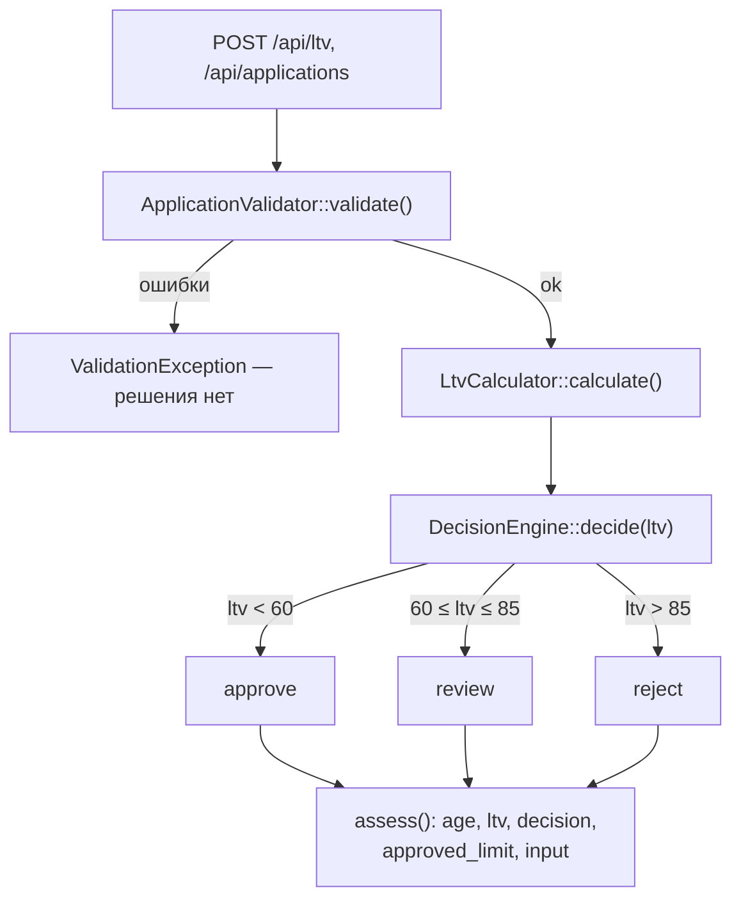

# Как считается решение по заявке (approve / review / reject)

Основано только на `backend/src/Domain/` и `backend/config/rules.php`. Точка
сборки графа объектов (`backend/src/AppFactory.php:27–39`) здесь упомянута
для полноты, но не входит в область разбора.

## 1. Участники и порядок вызова

### Сборка (`AppFactory.php:27–39`)

Подключается `backend/config/rules.php`, из него собираются:

- `ApplicationValidator($rules, VinValidator($rules['vin']), VehicleAge(текущий год))`
- `LtvCalculator()`
- `DecisionEngine($rules['ltv'])`

Всё это подаётся в конструктор `AssessmentService`.

### Конвейер `AssessmentService::assess(array $payload)`

`backend/src/Domain/AssessmentService.php:28–42`. Шаги строго по порядку:

1. **`ApplicationValidator::validate($payload)`** — нормализация и проверка
   полей `vin`, `year`, `mileage`, `market_value`, `requested_amount`,
   `term_months` (правила берутся из `rules.php`: секции `vin`, `vehicle`,
   `amount`, `term`). Любая ошибка → `ValidationException` со списком
   «поле → сообщение», конвейер останавливается: LTV и решение **в этом
   случае не считаются вообще**.
2. **`LtvCalculator::calculate($input['requested_amount'], $input['market_value'])`**
   — `round(сумма / стоимость * 100, 2)`. Внутри есть проверки >0; они
   дублируют валидатор, но для `DecisionEngine` это не существенно.
3. **`DecisionEngine::decide(float $ltv)`** — единственное место, где
   рождается решение. Пороги приходят из `rules['ltv']` (`approve_max = 60.0`,
   `review_max = 85.0`).
4. Сборка результата: `vehicle_age` (повторно через `VehicleAge::inYears`),
   `ltv`, `decision`, `approved_limit` (= `requested_amount` при `approve`,
   иначе 0), `input`.

### Таблица решения (`DecisionEngine.php:30–41`)

```php
if ($ltv < $this->approveMax) return self::APPROVE;
if ($ltv <= $this->reviewMax) return self::REVIEW;
return self::REJECT;
```

### Схема конвейера



### Факты, на которые стоит обратить внимание

- **Расхождение комментария и кода.** И в `DecisionEngine.php:10`, и в
  `rules.php:39` написано «`LTV <= approve_max` → approve», но код
  `DecisionEngine.php:32` использует строгое `<`. При LTV ровно 60.0
  решение будет `review`, а не `approve`.
- Справочник `ltv_by_age` (`rules.php:53–58`) заполнен, но **нигде в
  Domain не используется**. Прямо в `rules.php:50–52` и в
  `AssessmentService.php:11–12` указано, что это задача LOAN-12.

## 2. Куда встанет правило «пробег ≤ 400 000 км, иначе review»

**Ключевой факт:** решение сегодня принимает *только*
`DecisionEngine::decide(float $ltv)`. Пробег до принятия решения не доходит
ни в каком — между валидацией и решением он просто сидит в `$input`.

**Естественное место — `AssessmentService::assess()`, между строкой 33
(`$decision = $this->decisionEngine->decide($ltv)`) и `return` (строки
35–41):**

```php
$decision = $this->decisionEngine->decide($ltv);

if ($input['mileage'] > /* порог из rules.php */) {
    $decision = DecisionEngine::REVIEW;
}
```

Альтернатива — внутри `DecisionEngine::decide()`, но тогда придётся менять
его сигнатуру (сейчас `decide(float $ltv)`) и конструктор (сейчас
получает только `$rules['ltv']`).

### Что уже есть

- `$input['mileage']` — нормализованный `int`, к этому моменту
  гарантированно в диапазоне 0…500 000 (валидатор уже отсеял всё вне
  диапазона);
- константа `DecisionEngine::REVIEW`;
- точка в `assess()`, где `$decision` ещё можно изменить до сборки
  ответа;
- конфиг-механика `rules.php` для порога (по конвенции AGENTS.md число
  в код хардкодить нельзя).

### Чего не хватает

- **Порога 400 000 в `rules.php` — нет.** Единственный mileage-ключ —
  `max_mileage_km = 500000` (`rules.php:23`), и это потолок *валидации*,
  а не порог решения — другая семантика. Нужен новый ключ в секции
  `vehicle`.
- **Пробег в `DecisionEngine` — не передаётся.** Сигнатура
  `decide(float $ltv)` пробег не принимает.
- **Доступа `AssessmentService` к правилам — нет.** В его конструкторе
  нет `$rules` (только `validator`, `ltvCalculator`, `decisionEngine`,
  `vehicleAge`). Порог ему неоткуда взять без прокидывания извне.
- **Механизма приоритета правил — нет.** Код не отвечает на вопрос
  «LTV говорит `reject`, пробег говорит `review` — что важнее?».
  Буквальное прочтение «иначе решение review» означало бы перезапись
  `reject` → `review`. Никакого механизма переопределения/понижения
  решения в коде не существует.
- Отдельного слоя «правил поверх LTV» — нет.

### Граница срабатывания

Зона фактического срабатывания правила: **400 001…500 000 км**. Именно
этот интервал проходит валидацию (`max_mileage_km = 500000`), но
превышает новый порог. До 400 000 решение остаётся чисто LTV-шным.

Граничный случай: «не больше 400 000» означает, что ровно 400 000 —
допустимо (стиль совпадает с валидацией, где `500000` тоже проходит, т.к.
проверка `mileage > max_mileage_km`, строго `>`).

## 3. Что уже сейчас проверяется про пробег

Ровно одна проверка, **`ApplicationValidator.php:43–46`**:

```php
$mileage = (int) ($payload['mileage'] ?? -1);
if ($mileage < 0 || $mileage > $this->rules['vehicle']['max_mileage_km']) {
    $errors['mileage'] = sprintf('Пробег от 0 до %d км', ...);
}
```

То есть: поле обязательно (отсутствие → `-1` → ошибка), целое,
неотрицательное, не больше 500 000 км из
`rules['vehicle']['max_mileage_km']`. Нарушение → `ValidationException`,
заявка не доходит до LTV и решения.

Дальше пробег только «путешествует» по конвейеру: возвращается в
нормализованном `$input` (`ApplicationValidator.php:78`), попадает в
ответ `assess()` под ключом `input`.

В расчёте LTV, в `DecisionEngine`, в `approved_limit` пробег **не
участвует — нет**. Других проверок пробега в `backend/src/Domain/` —
**нет**.