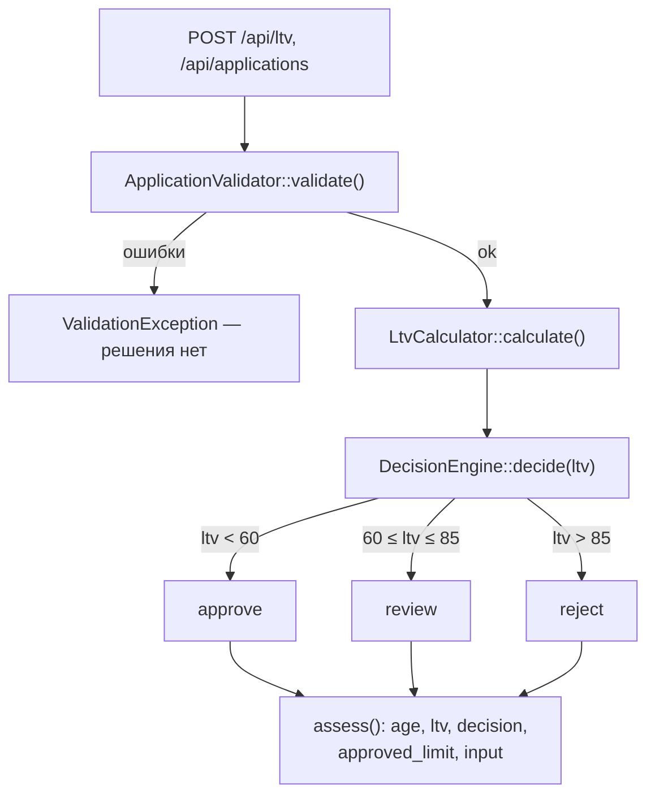
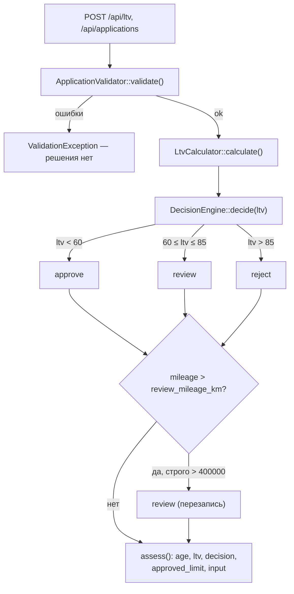

# Как считается решение по заявке (approve / review / reject)

Основано только на `backend/src/Domain/` и `backend/config/rules.php`. Точка
сборки графа объектов (`backend/src/AppFactory.php:27–39`) здесь упомянута
для полноты, но не входит в область разбора.

## 1. Участники и порядок вызова

### Сборка (`AppFactory.php:27–39`)

Подключается `backend/config/rules.php`, из него собираются:

- `ApplicationValidator($rules, VinValidator($rules['vin']), VehicleAge(текущий год))`
- `LtvCalculator()`
- `DecisionEngine($rules['ltv'])`

Всё это подаётся в конструктор `AssessmentService`.

### Конвейер `AssessmentService::assess(array $payload)`

`backend/src/Domain/AssessmentService.php:28–42`. Шаги строго по порядку:

1. **`ApplicationValidator::validate($payload)`** — нормализация и проверка
   полей `vin`, `year`, `mileage`, `market_value`, `requested_amount`,
   `term_months` (правила берутся из `rules.php`: секции `vin`, `vehicle`,
   `amount`, `term`). Любая ошибка → `ValidationException` со списком
   «поле → сообщение», конвейер останавливается: LTV и решение **в этом
   случае не считаются вообще**.
2. **`LtvCalculator::calculate($input['requested_amount'], $input['market_value'])`**
   — `round(сумма / стоимость * 100, 2)`. Внутри есть проверки >0; они
   дублируют валидатор, но для `DecisionEngine` это не существенно.
3. **`DecisionEngine::decide(float $ltv)`** — единственное место, где
   рождается решение. Пороги приходят из `rules['ltv']` (`approve_max = 60.0`,
   `review_max = 85.0`).
4. Сборка результата: `vehicle_age` (повторно через `VehicleAge::inYears`),
   `ltv`, `decision`, `approved_limit` (= `requested_amount` при `approve`,
   иначе 0), `input`.

### Таблица решения (`DecisionEngine.php:30–41`)

```php
if ($ltv < $this->approveMax) return self::APPROVE;
if ($ltv <= $this->reviewMax) return self::REVIEW;
return self::REJECT;
```

### Схема конвейера


```mermaid
flowchart TD
    A["POST /api/ltv, /api/applications"] --> B["ApplicationValidator::validate()"]
    B -->|ошибки| X["ValidationException — решения нет"]
    B -->|ok| C["LtvCalculator::calculate()"]
    C --> D["DecisionEngine::decide(ltv)"]
    D -->|ltv &lt; 60| E["approve"]
    D -->|60 ≤ ltv ≤ 85| F["review"]
    D -->|ltv &gt; 85| G["reject"]
    E & F & G --> H["assess(): age, ltv, decision,<br/>approved_limit, input"]
```

### Факты, на которые стоит обратить внимание

- **Расхождение комментария и кода.** И в `DecisionEngine.php:10`, и в
  `rules.php:39` написано «`LTV <= approve_max` → approve», но код
  `DecisionEngine.php:32` использует строгое `<`. При LTV ровно 60.0
  решение будет `review`, а не `approve`.
- Справочник `ltv_by_age` (`rules.php:53–58`) заполнен, но **нигде в
  Domain не используется**. Прямо в `rules.php:50–52` и в
  `AssessmentService.php:11–12` указано, что это задача LOAN-12.

## 2. Правило «пробег ≤ 400 000 км, иначе review»

Реализовано: между `$decision = $this->decisionEngine->decide($ltv)` и
сборкой результата в `AssessmentService::assess()`
(`backend/src/Domain/AssessmentService.php:35–37`) выполняется строгая
проверка `$input['mileage'] > $this->reviewMileageKm` — при пробеге
строго больше порога вердикт перезаписывается на `DecisionEngine::REVIEW`
безусловно (включая случай, когда по LTV был `reject`). До этой проверки
пробег в расчёте не участвует — это правило поверх решения по LTV.

Параметры правила:

- порог хранится в `rules['vehicle']['review_mileage_km'] = 400000`
  (`backend/config/rules.php:25–28`); это порог *решения*, а не
  валидации ввода;
- потолок валидации пробега остаётся прежним —
  `rules['vehicle']['max_mileage_km'] = 500000`
  (`backend/config/rules.php:24`); заявки с пробегом 400 001–500 000 км
  проходят валидацию и доходят до расчёта решения;
- порог передаётся в `AssessmentService` пятым аргументом конструктора
  (`backend/src/AppFactory.php:38`) — единственное место сборки;
- граница включительная: ровно 400 000 не срабатывает, зона действия —
  400 001–500 000 км.

`approved_limit` при срабатывании правила = 0: ноль получается за счёт
существующей формулы
(`$decision === DecisionEngine::APPROVE ? ... : 0`), своего расчёта
лимита правило не вводит.

`DecisionEngine` правило не трогает: сигнатура `decide(float $ltv)` и
конструктор (`$rules['ltv']`) сохраняются.

### Схема конвейера


```mermaid
flowchart TD
    A["POST /api/ltv, /api/applications"] --> B["ApplicationValidator::validate()"]
    B -->|ошибки| X["ValidationException — решения нет"]
    B -->|ok| C["LtvCalculator::calculate()"]
    C --> D["DecisionEngine::decide(ltv)"]
    D -->|ltv < 60| E["approve"]
    D -->|60 ≤ ltv ≤ 85| F["review"]
    D -->|ltv > 85| G["reject"]
    E & F & G --> H{"mileage > review_mileage_km?"}
    H -->|да, строго > 400000| F2["review (перезапись)"]
    H -->|нет| I["assess(): age, ltv, decision,<br/>approved_limit, input"]
    F2 --> I
```

## 3. Что уже сейчас проверяется про пробег

Ровно одна проверка, **`ApplicationValidator.php:43–46`**:

```php
$mileage = (int) ($payload['mileage'] ?? -1);
if ($mileage < 0 || $mileage > $this->rules['vehicle']['max_mileage_km']) {
    $errors['mileage'] = sprintf('Пробег от 0 до %d км', ...);
}
```

То есть: поле обязательно (отсутствие → `-1` → ошибка), целое,
неотрицательное, не больше 500 000 км из
`rules['vehicle']['max_mileage_km']`. Нарушение → `ValidationException`,
заявка не доходит до LTV и решения.

Дальше пробег только «путешествует» по конвейеру: возвращается в
нормализованном `$input` (`ApplicationValidator.php:78`), попадает в
ответ `assess()` под ключом `input`.

В расчёте LTV, в `DecisionEngine`, в `approved_limit` пробег **не
участвует — нет**. Других проверок пробега в `backend/src/Domain/` —
**нет**.